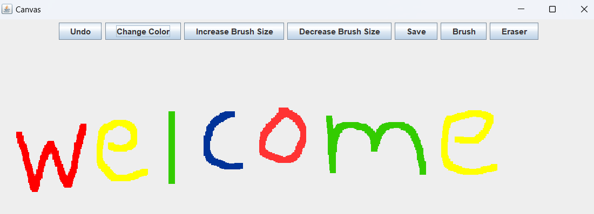

# Canvas

Canvas is a simple, easy-to-use Java application that allows users to draw on a digital canvas. It provides various tools such as a brush, eraser, color picker, and the ability to save your artwork.

## Technologies used

- **Java**

- **Object Oriented programming**

## Features

- **Drawing**: Use the brush tool to draw on the canvas. You can adjust the brush size to your liking.
- **Erasing**: Made a mistake? No problem! Use the eraser tool to correct it.
- **Color Picker**: Choose your favorite colors to draw with using the color picker.
- **Save Your Artwork**: You can save your artwork as a PNG file to your local system.
- **Undo**: If you're not happy with your last stroke, you can easily undo it.
- **Clear Canvas**: Start over with a clean slate at any time by clearing the canvas.

## How to Use

1. Clone this repository to your local system.
2. Open the project in your favorite IDE
3. Run the `CanvasFrame.java` file to start the application.
4. Use the toolbar at the top of the application window to select your desired tool and color.
5. Draw on the canvas by clicking and dragging your mouse.
6. Save your artwork by clicking the "Save" button and providing a file name.

## License

This project is licensed under the terms of the MIT license.
